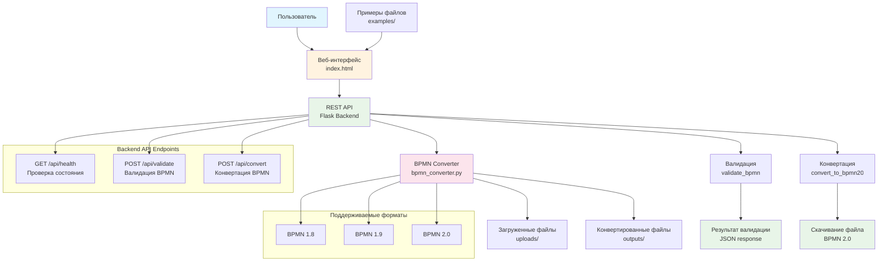

# 🔄 Конвертер BPMN версий

Веб-сервис для конвертации BPMN схем из старых версий (1.8/1.9) в новый формат BPMN 2.0.

## 📋 Возможности

- ✅ Конвертация BPMN 1.8/1.9 → BPMN 2.0
- ✅ Валидация входных BPMN файлов
- ✅ Современный веб-интерфейс с drag & drop
- ✅ REST API для интеграции
- ✅ Поддержка файлов .xml и .bpmn
- ✅ Автоматическое определение версии BPMN
- ✅ **Поддержка нестандартных форматов BPMN** (корпоративные и специализированные редакторы)
- ✅ Обработка крупных файлов (тысячи элементов)

## 🚀 Быстрый старт

### Требования

- Python 3.8+
- Современный веб-браузер

### Установка

1. Клонируйте репозиторий:
```bash
git clone <repository-url>
cd bpmn_upgrade
```

2. Установите зависимости:
```bash
pip install -r requirements.txt
```

3. Запустите бэкенд:
```bash
cd backend
python app.py
```

4. Откройте веб-интерфейс:
```bash
# В новом терминале
cd frontend
# Откройте index.html в браузере или используйте локальный веб-сервер:
python -m http.server 8080
```

5. Перейдите в браузере по адресу: `http://localhost:8080`

## 📁 Структура проекта

```
bpmn_upgrade/
├── backend/
│   ├── app.py              # Flask приложение
│   ├── bpmn_converter.py   # Основной класс конвертера
│   ├── uploads/            # Папка для загруженных файлов
│   └── outputs/            # Папка для конвертированных файлов
├── frontend/
│   └── index.html          # Веб-интерфейс
├── examples/               # Примеры BPMN файлов
│   ├── example_bpmn18.xml
│   └── example_bpmn19_complex.xml
├── requirements.txt        # Python зависимости
├── start_service.py        # Скрипт автоматического запуска
└── README.md              # Документация
```

## 🏗️ Архитектура системы



## 🔧 API Endpoints

### `GET /api/health`
Проверка работоспособности сервиса.

**Ответ:**
```json
{
  "status": "OK",
  "message": "BPMN Converter Service is running"
}
```

### `POST /api/validate`
Валидация BPMN файла.

**Параметры:**
- `file`: BPMN файл (.xml или .bpmn)

**Ответ:**
```json
{
  "valid": true,
  "version": "1.8",
  "processes": 1,
  "elements": 25,
  "message": "Файл валиден. Обнаружена версия BPMN 1.8"
}
```

### `POST /api/convert`
Конвертация BPMN файла в версию 2.0.

**Параметры:**
- `file`: BPMN файл (.xml или .bpmn)

**Ответ:**
- Файл в формате BPMN 2.0 для скачивания

## 🛠️ Использование

### Веб-интерфейс

1. Откройте `http://localhost:8080`
2. Перетащите файл BPMN в область загрузки или нажмите для выбора
3. Нажмите "Проверить файл" для валидации (опционально)
4. Нажмите "Конвертировать" для преобразования в BPMN 2.0
5. Скачайте конвертированный файл

### Программное использование

```python
from bpmn_converter import BPMNConverter

converter = BPMNConverter()

# Валидация файла
validation_result = converter.validate_bpmn('input.bpmn')
print(validation_result)

# Конвертация файла
success = converter.convert_to_bpmn20('input.bpmn', 'output.bpmn')
if success:
    print("Конвертация успешна!")
```

## 📊 Поддерживаемые форматы и элементы BPMN

### Поддерживаемые форматы файлов
- **Стандартные BPMN** (с namespace definitions)
- **Нестандартные форматы** (с корневым элементом `<BPMN>`)
- **Корпоративные форматы** (BusinessProcessDiagram, Process, Tasks)
- **Большие файлы** (до 30,000+ элементов)

### События
- Start Event (стартовое событие)
- End Event (конечное событие)
- Intermediate Catch Event (промежуточное событие перехвата)
- Intermediate Throw Event (промежуточное событие бросания)
- Boundary Event (граничное событие)

### Задачи
- Task (задача)
- User Task (пользовательская задача)
- Service Task (служебная задача)
- Script Task (задача скрипта)
- Business Rule Task (задача бизнес-правила)
- Send Task (задача отправки)
- Receive Task (задача получения)
- Manual Task (ручная задача)

### Шлюзы
- Exclusive Gateway (исключающий шлюз)
- Parallel Gateway (параллельный шлюз)
- Inclusive Gateway (включающий шлюз)
- Complex Gateway (сложный шлюз)

### Соединения
- Sequence Flow (поток управления)
- Message Flow (поток сообщений)
- Association (ассоциация)

### Данные
- Data Object (объект данных)
- Data Store (хранилище данных)

### Подпроцессы
- Sub Process (подпроцесс)
- Call Activity (вызов активности)

## 🔍 Особенности конвертации

### Изменения в namespace
- Обновление XML namespace с версий 1.8/1.9 на BPMN 2.0
- Правильная структура `definitions` элемента
- Корректные атрибуты `targetNamespace`

### Обработка элементов
- Маппинг элементов между версиями
- Сохранение всех атрибутов и свойств
- Корректная обработка условных выражений
- Сохранение диаграммной информации

### Валидация
- Проверка структуры XML
- Определение версии BPMN
- Подсчет процессов и элементов
- Детальная информация об ошибках

## 🐛 Устранение неисправностей

### Сервер не запускается
- Проверьте, что все зависимости установлены: `pip install -r requirements.txt`
- Убедитесь, что порт 5000 свободен
- Проверьте Python версию (требуется 3.8+)

### Ошибки конвертации
- Проверьте, что файл является валидным XML
- Убедитесь, что файл содержит BPMN структуру
- Проверьте размер файла (лимит 16MB)

### Проблемы с веб-интерфейсом
- Проверьте, что бэкенд запущен на порту 5001
- Убедитесь, что CORS настроен корректно
- Проверьте консоль браузера на наличие ошибок JavaScript

## 📝 Примеры использования

### Пример 1: Простая конвертация
```bash
# Запуск API
curl -X POST -F "file=@example.bpmn" http://localhost:5001/api/convert -o converted.bpmn
```

### Пример 2: Валидация файла
```bash
curl -X POST -F "file=@example.bpmn" http://localhost:5001/api/validate
```

## 🤝 Вклад в проект

1. Форкните репозиторий
2. Создайте ветку для новой функции (`git checkout -b feature/amazing-feature`)
3. Сделайте изменения и коммит (`git commit -m 'Add amazing feature'`)
4. Запушьте в ветку (`git push origin feature/amazing-feature`)
5. Создайте Pull Request

## 📄 Лицензия

Этот проект распространяется под лицензией MIT. Подробности в файле `LICENSE`.

## 📞 Поддержка

По вопросам и предложениям создавайте Issues в GitHub репозитории.

---

**Разработано с ❤️ для упрощения работы с BPMN схемами** 